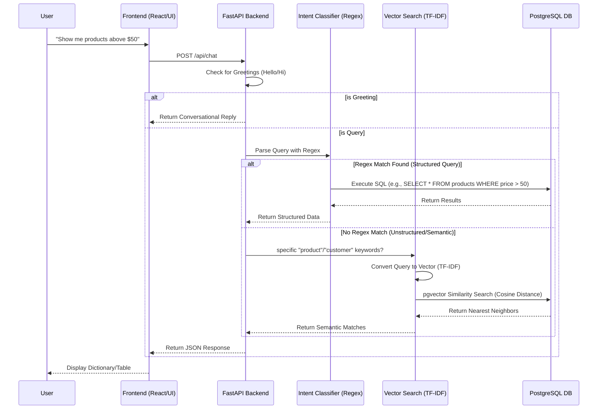

# Interview Preparation: Natural Language to SQL with Hybrid Search

## 1. Project Overview
**"I built a search-enabled database assistant that allows users to query business data (Employees, Orders, Products) using natural language. Instead of writing complex SQL queries, users can ask 'Show me orders by John' or 'Find cheap products', and the system intelligently retrieves the data using a hybrid approach combining Rule-Based NLP and Vector Semantic Search powered by PostgreSQL and FastAPI."**

---

## 2. Workflow Execution & Diagram
The following diagram illustrates the data flow from the user's request to the final response.

### Step-by-Step Flow:
1.  **User Request**: User sends a natural language query.
2.  **API Entry**: Request hits `api/index.py`.
3.  **Intent Classification**:
    *   **Greeting Check**: Simple string matching for "hi", "hello".
    *   **Regex Parsing**: `app/nlp_sql.py` checks patterns (e.g., `above \d+`) to build precise SQL.
    *   **Fallback (Vector Search)**: If regex fails, `app/hybrid_search.py` converts text to vectors and queries the DB using `pgvector`.
4.  **Execution**: The appropriate SQL is run against Postgres.
5.  **Response**: JSON data is returned to the client.

---

## 3. Methodologies & Techniques

### A. Rule-Based NLP (Regular Expressions)
*   **What**: Using patterns like `r"above\s+(\d+)"` to extract specific constraints.
*   **Why**:
    *   **Precision**: 100% accurate for numerical/logic filters.
    *   **Cost/Speed**: Zero latency, no API costs compared to LLMs.
    *   **Safety**: Prevents hallucinated queries.

### B. Semantic Search (TF-IDF + Embeddings)
*   **What**: converting text into numerical vectors that represent meaning.
*   **Why**: Handles fuzzy matching (e.g., "phone" matches "smartphone").
*   **How**:
    *   **TF-IDF**: Calculates word importance (rare words weigh more).
    *   **pgvector**: Postgres extension to store vectors and perform similarity searches.
    *   **Cosine Similarity**: Used to find the "closest" product vector to the query vector.

### C. Hybrid Search Architecture
*   **What**: Combining **Structured Rules** (SQL) with **Unstructured Similarity** (Vectors).
*   **Why**: Provides the robustness of traditional databases with the flexibility of modern AI search.

---

## 4. Key Technical Terms

| Term | project definition |
| :--- | :--- |
| **FastAPI** | High-performance Python web framework used for the backend API. |
| **PostgreSQL** | Primary relational database used for storing business data. |
| **pgvector** | PostgreSQL extension enabling vector storage and similarity search (AI capabilities). |
| **TF-IDF** | *Term Frequency-Inverse Document Frequency*. Algorithm used to vectorize text. |
| **Cosine Distance `<#>`** | Metric used by Postgres to rank how similar two vectors are. |
| **Parameterized Queries** | Security technique (using `:value` placeholders) to prevent SQL Injection attacks. |
| **REST API** | The architectural style used for communication between the frontend and backend. |
